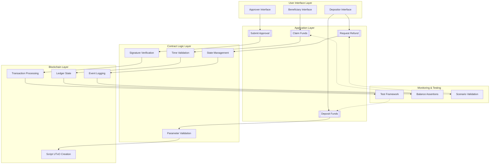
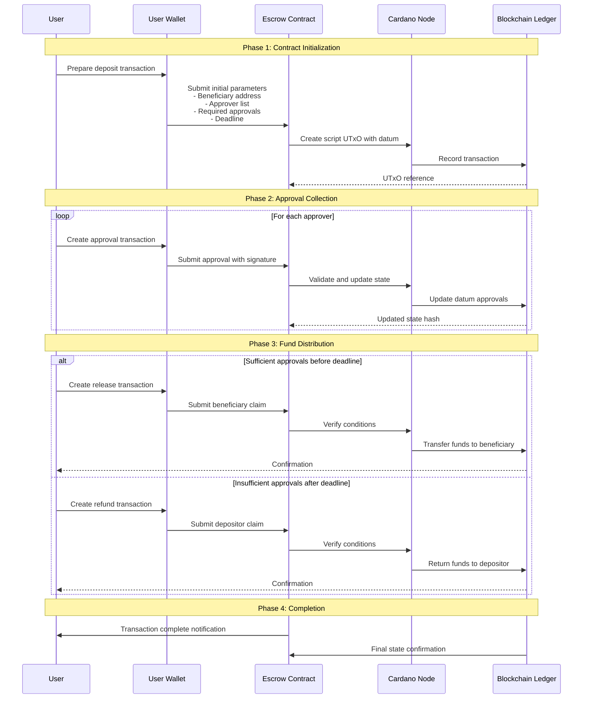
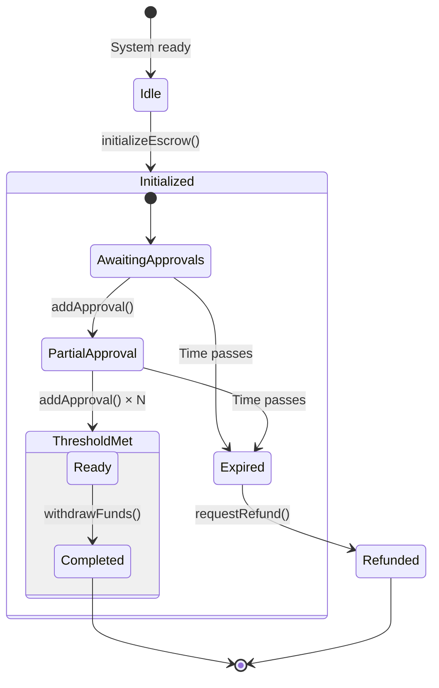

# 🔐 Multi-Signature Escrow Smart Contract

This tutorial provides a comprehensive guide to building a secure multi-signature escrow smart contract (`MultiSigEscrow.hs`) for Cardano using Plutus. The contract implements a flexible approval system where funds can only be released with sufficient authorized signatures before a specified deadline, with automated refund capabilities.

---

## 📚 Table of Contents

1. [🏗️ System Architecture](#1-system-architecture)
2. [📦 Required Libraries](#2-required-libraries)
3. [🗃️ Data Models](#3-data-models)
4. [🧠 Validation Logic](#4-validation-logic)
5. [⚙️ Script Generation](#5-script-generation)
6. [🔌 Contract Interface](#6-contract-interface)
7. [🔄 Operational Workflow](#7-operational-workflow)
8. [🧪 Test Suite](#8-test-suite)
9. [✅ Development Guidelines](#9-development-guidelines)
10. [📘 Terminology Reference](#10-terminology-reference)

---

## 1. 🏗️ System Architecture

### Component Architecture



### Transaction Flow



---

## 2. 📦 Required Libraries

### Core Contract Imports (`MultiSigEscrow.hs`)
```haskell
{-# LANGUAGE DataKinds           #-}
{-# LANGUAGE DeriveAnyClass      #-}
{-# LANGUAGE DeriveGeneric       #-}
{-# LANGUAGE FlexibleContexts    #-}
{-# LANGUAGE NoImplicitPrelude   #-}
{-# LANGUAGE OverloadedStrings   #-}
{-# LANGUAGE ScopedTypeVariables #-}
{-# LANGUAGE TemplateHaskell     #-}
{-# LANGUAGE TypeApplications    #-}
{-# LANGUAGE TypeFamilies        #-}
{-# LANGUAGE TypeOperators       #-}

module MultiSigEscrow where

-- Plutus Core Libraries
import           Plutus.V2.Ledger.Api       -- Smart contract primitives
import           Plutus.V2.Ledger.Contexts  -- Transaction context access
import           Plutus.V1.Ledger.Interval  -- Time interval handling
import           PlutusTx                   -- Template Haskell compilation
import           PlutusTx.Prelude           -- On-chain prelude functions

-- Data and Validation
import qualified Prelude                    as Haskell
import           Data.Aeson                 (FromJSON, ToJSON)
import           GHC.Generics               (Generic)
```

### Contract Interface Imports (`ContractInterface.hs`)
```haskell
module ContractInterface where

-- Contract Development
import           Plutus.Contract            -- Off-chain contract logic
import           Plutus.Trace.Emulator      -- Test simulation framework

-- Transaction Building
import           Ledger                     -- Address and transaction types
import           Ledger.Ada                 -- ADA value handling
import           Ledger.Constraints         -- Transaction constraints
import           Ledger.Typed.Scripts       -- Typed validator support

-- Wallet Management
import           Wallet.Emulator            -- Wallet simulation
import           Wallet.Emulator.Wallet     -- Predefined test wallets

-- Utilities
import           Control.Monad              (void)
import qualified Data.Map                   as Map
import           Data.Text                  (Text)
import           Data.Default               (Default, def)
```

---

## 3. 🗃️ Data Models

### Escrow Configuration Data
```haskell
-- | Represents the complete state of an escrow agreement
data EscrowConfig = EscrowConfig
    { configDepositor   :: PubKeyHash    -- Original fund provider
    , configBeneficiary :: PubKeyHash    -- Intended recipient
    , configApprovers   :: [PubKeyHash]  -- Authorized signatories
    , configReceived    :: [PubKeyHash]  -- Collected signatures
    , configThreshold   :: Integer       -- Minimum required approvals
    , configExpiry      :: POSIXTime     -- Contract validity period
    }
    deriving (Haskell.Show, Generic, FromJSON, ToJSON)

PlutusTx.unstableMakeIsData ''EscrowConfig
PlutusTx.makeLift ''EscrowConfig

-- | Available operations on the escrow contract
data ContractOperation
    = SubmitApproval     -- Add an authorized signature
    | ExecuteWithdrawal  -- Release funds to beneficiary
    | InitiateRefund     -- Return funds to depositor
    deriving (Haskell.Show, Generic, FromJSON, ToJSON)

PlutusTx.unstableMakeIsData ''ContractOperation
PlutusTx.makeLift ''ContractOperation
```

### Parameter Validation Types
```haskell
-- | Validation parameters for contract operations
data ValidationParams = ValidationParams
    { paramCurrentTime   :: POSIXTime      -- Transaction timestamp
    , paramSignatories   :: [PubKeyHash]   -- Transaction signers
    , paramOperation     :: ContractOperation -- Requested operation
    }
    deriving (Haskell.Show)

-- | Validation result with detailed error information
data ValidationResult
    = ValidationSuccess
    | ValidationFailure ValidationError
    deriving (Haskell.Show)

-- | Detailed validation error messages
data ValidationError
    = InvalidSignature
    | TimeConstraintViolated
    | InsufficientApprovals
    | DuplicateApproval
    | UnauthorizedOperation
    deriving (Haskell.Show, Eq)
```

---

## 4. 🧠 Validation Logic

### Validation Helper Functions
```haskell
{-# INLINABLE validateSignature #-}
validateSignature :: PubKeyHash -> ScriptContext -> Bool
validateSignature pubKey ctx =
    let signatories = txInfoSignatories $ scriptContextTxInfo ctx
    in pubKey `elem` signatories

{-# INLINABLE validateTimeWindow #-}
validateTimeWindow :: POSIXTime -> ScriptContext -> Bool
validateTimeWindow expiry ctx =
    let txInfo = scriptContextTxInfo ctx
        validityRange = txInfoValidRange txInfo
    in validityRange `contains` interval 0 (to expiry)

{-# INLINABLE validateExpired #-}
validateExpired :: POSIXTime -> ScriptContext -> Bool
validateExpired expiry ctx =
    let txInfo = scriptContextTxInfo ctx
        validityRange = txInfoValidRange txInfo
    in validityRange `contains` interval (from expiry) 0

{-# INLINABLE isAuthorizedApprover #-}
isAuthorizedApprover :: PubKeyHash -> EscrowConfig -> Bool
isAuthorizedApprover pubKey config =
    pubKey `elem` configApprovers config

{-# INLINABLE hasNotApproved #-}
hasNotApproved :: PubKeyHash -> EscrowConfig -> Bool
hasNotApproved pubKey config =
    not (pubKey `elem` configReceived config)

{-# INLINABLE meetsThreshold #-}
meetsThreshold :: EscrowConfig -> Bool
meetsThreshold config =
    length (configReceived config) >= configThreshold config
```

### Core Validator Implementation
```haskell
{-# INLINABLE contractValidator #-}
contractValidator :: EscrowConfig -> ContractOperation -> ScriptContext -> Bool
contractValidator config operation ctx = case operation of
    SubmitApproval    -> validateApproval config ctx
    ExecuteWithdrawal -> validateWithdrawal config ctx
    InitiateRefund    -> validateRefund config ctx

{-# INLINABLE validateApproval #-}
validateApproval :: EscrowConfig -> ScriptContext -> Bool
validateApproval config ctx =
    traceIfFalse "Transaction must occur before expiry" 
        (validateTimeWindow (configExpiry config) ctx)
    && traceIfFalse "Exactly one approver must sign" 
        (length (txInfoSignatories $ scriptContextTxInfo ctx) == 1)
    && traceIfFalse "Signer must be authorized approver" 
        (any (\signer -> isAuthorizedApprover signer config 
                         && hasNotApproved signer config) 
              (txInfoSignatories $ scriptContextTxInfo ctx))

{-# INLINABLE validateWithdrawal #-}
validateWithdrawal :: EscrowConfig -> ScriptContext -> Bool
validateWithdrawal config ctx =
    traceIfFalse "Transaction must occur before expiry" 
        (validateTimeWindow (configExpiry config) ctx)
    && traceIfFalse "Insufficient approvals received" 
        (meetsThreshold config)
    && traceIfFalse "Beneficiary must authorize withdrawal" 
        (validateSignature (configBeneficiary config) ctx)

{-# INLINABLE validateRefund #-}
validateRefund :: EscrowConfig -> ScriptContext -> Bool
validateRefund config ctx =
    traceIfFalse "Transaction must occur after expiry" 
        (validateExpired (configExpiry config) ctx)
    && traceIfFalse "Threshold already met, cannot refund" 
        (not $ meetsThreshold config)
    && traceIfFalse "Depositor must authorize refund" 
        (validateSignature (configDepositor config) ctx)
```

---

## 5. ⚙️ Script Generation

### Validator Compilation
```haskell
-- | Unlifted validator function for compilation
{-# INLINABLE untypedValidator #-}
untypedValidator :: BuiltinData -> BuiltinData -> BuiltinData -> ()
untypedValidator configData opData contextData =
    check $ contractValidator
        (PlutusTx.unsafeFromBuiltinData configData)
        (PlutusTx.unsafeFromBuiltinData opData)
        (PlutusTx.unsafeFromBuiltinData contextData)

-- | Compiled validator script
compiledValidator :: Script
compiledValidator = fromCompiledCode $$
    PlutusTx.compile [|| untypedValidator ||]

-- | Typed validator for contract interface
escrowValidator :: Validator
escrowValidator = mkValidatorScript compiledValidator

-- | Contract address derivation
contractAddress :: Address
contractAddress = scriptAddress escrowValidator
```

### Script Utilities
```haskell
-- | Generate validator hash for reference
validatorHash :: ValidatorHash
validatorHash = validatorHash escrowValidator

-- | Create datum for contract state
createDatum :: EscrowConfig -> Datum
createDatum = Datum . toBuiltinData

-- | Create redeemer for contract operation
createRedeemer :: ContractOperation -> Redeemer
createRedeemer = Redeemer . toBuiltinData
```

---

## 6. 🔌 Contract Interface

### Contract Schema Definition
```haskell
-- | Complete contract interface schema
type EscrowContractSchema =
        Endpoint "initialize" 
            ( PubKeyHash      -- beneficiary
            , [PubKeyHash]    -- approvers
            , Integer         -- threshold
            , POSIXTime       -- expiry
            , Integer         -- amount in lovelace
            )
    .\/ Endpoint "addApproval" ()
    .\/ Endpoint "withdrawFunds" ()
    .\/ Endpoint "requestRefund" ()
    .\/ Endpoint "queryState" ()
```

### Contract Operations
```haskell
-- | Initialize a new escrow agreement
initializeEscrow :: Contract () EscrowContractSchema Text ()
initializeEscrow = do
    (beneficiary, approvers, threshold, expiry, amount) <- 
        endpoint @"initialize"
    
    depositor <- pubKeyHash <$> ownPaymentPubKeyHash
    
    let initialState = EscrowConfig
            { configDepositor   = depositor
            , configBeneficiary = beneficiary
            , configApprovers   = approvers
            , configReceived    = []
            , configThreshold   = threshold
            , configExpiry      = expiry
            }
    
    let constraints = mustPayToTheScript 
            (createDatum initialState) 
            (lovelaceValueOf amount)
    
    transactionId <- submitTxConstraints escrowValidator constraints
    awaitTxConfirmed transactionId
    
    logInfo @Text $ mconcat
        [ "Escrow initialized with "
        , Haskell.show amount
        , " lovelaces"
        ]

-- | Add an approval to existing escrow
addApproval :: Contract () EscrowContractSchema Text ()
addApproval = do
    approverKey <- pubKeyHash <$> ownPaymentPubKeyHash
    
    scriptUtxos <- utxosAt contractAddress
    case Map.toList scriptUtxos of
        [] -> logError "No active escrow found"
        [(utxoRef, output)] -> do
            let Just currentState = getDatum output
            if approverKey `elem` configApprovers currentState 
               && not (approverKey `elem` configReceived currentState)
            then do
                let updatedState = currentState 
                        { configReceived = approverKey : configReceived currentState }
                
                let constraints = mustSpendScriptOutput 
                        utxoRef 
                        (createRedeemer SubmitApproval)
                        <> mustPayToTheScript 
                            (createDatum updatedState) 
                            (txOutValue $ txOutTxOut output)
                
                transactionId <- submitTxConstraintsSpending 
                    escrowValidator 
                    scriptUtxos 
                    constraints
                awaitTxConfirmed transactionId
                
                logInfo @Text $ "Approval added by " <> Haskell.show approverKey
            else logError "Unable to add approval"
        _ -> logError "Multiple escrow contracts found"

-- | Withdraw funds to beneficiary
withdrawFunds :: Contract () EscrowContractSchema Text ()
withdrawFunds = do
    beneficiaryKey <- pubKeyHash <$> ownPaymentPubKeyHash
    
    scriptUtxos <- utxosAt contractAddress
    case Map.toList scriptUtxos of
        [] -> logError "No active escrow found"
        [(utxoRef, output)] -> do
            let Just currentState = getDatum output
            if beneficiaryKey == configBeneficiary currentState
            then do
                let constraints = mustSpendScriptOutput 
                        utxoRef 
                        (createRedeemer ExecuteWithdrawal)
                        <> mustPayToPubKey 
                            (PaymentPubKeyHash beneficiaryKey) 
                            (txOutValue $ txOutTxOut output)
                
                transactionId <- submitTxConstraintsSpending 
                    escrowValidator 
                    scriptUtxos 
                    constraints
                awaitTxConfirmed transactionId
                
                logInfo @Text $ "Funds released to " <> Haskell.show beneficiaryKey
            else logError "Not authorized to withdraw"
        _ -> logError "Multiple escrow contracts found"

-- | Query current escrow state
queryState :: Contract () EscrowContractSchema Text ()
queryState = do
    scriptUtxos <- utxosAt contractAddress
    case Map.toList scriptUtxos of
        [] -> logInfo "No active escrow found"
        [(_, output)] -> do
            let Just state = getDatum output
            let approvals = configReceived state
            let threshold = configThreshold state
            let remaining = threshold - length approvals
            let expiryTime = configExpiry state
            
            logInfo @Text $ mconcat
                [ "Escrow State: "
                , Haskell.show (length approvals)
                , "/"
                , Haskell.show threshold
                , " approvals received"
                ]
            
            logInfo @Text $ mconcat
                [ "Remaining approvals needed: "
                , Haskell.show remaining
                ]
            
            logInfo @Text $ mconcat
                [ "Expiry time: "
                , Haskell.show expiryTime
                ]
        _ -> logError "Multiple escrow contracts found"
```

---

## 7. 🔄 Operational Workflow

### State Management Flow



### Workflow Example
```haskell
-- Example: 3-of-5 multisig escrow workflow
exampleWorkflow :: IO ()
exampleWorkflow = do
    putStrLn "=== Multi-Signature Escrow Workflow Example ==="
    putStrLn ""
    
    -- Configuration
    let depositAmount = 50000000  -- 50 ADA
    let approverCount = 5
    let requiredSignatures = 3
    let expiryPeriod = 3600  -- 1 hour in seconds
    
    putStrLn "Configuration:"
    putStrLn $ "  - Deposit: " ++ show depositAmount ++ " lovelaces"
    putStrLn $ "  - Approvers: " ++ show approverCount
    putStrLn $ "  - Required: " ++ show requiredSignatures ++ " signatures"
    putStrLn $ "  - Expiry: " ++ show expiryPeriod ++ " seconds"
    putStrLn ""
    
    -- Step 1: Contract initialization
    putStrLn "Step 1: Initializing escrow contract..."
    putStrLn "  - Generating depositor keys"
    putStrLn "  - Setting beneficiary address"
    putStrLn "  - Configuring approver list"
    putStrLn "  - Setting approval threshold"
    putStrLn "  - Defining expiry timestamp"
    putStrLn ""
    
    -- Step 2: Approval collection
    putStrLn "Step 2: Collecting approvals..."
    putStrLn $ "  - Need " ++ show requiredSignatures ++ " of " ++ show approverCount
    putStrLn "  - Each approver submits signed transaction"
    putStrLn "  - State updates with each approval"
    putStrLn "  - Progress: 0/3 → 1/3 → 2/3 → 3/3"
    putStrLn ""
    
    -- Step 3: Fund release or refund
    putStrLn "Step 3: Finalizing escrow..."
    putStrLn "  - Checking current time vs expiry"
    putStrLn "  - Verifying approval threshold met"
    putStrLn "  - Validating beneficiary signature"
    putStrLn "  - Executing fund transfer"
    putStrLn ""
    
    putStrLn "=== Workflow Complete ==="
```

---

## 8. 🧪 Test Suite

### Test Configuration
```haskell
-- | Test scenario configurations
data TestScenario = TestScenario
    { scenarioName     :: Text
    , scenarioWallets  :: [Wallet]
    , scenarioAmount   :: Integer
    , scenarioRequired :: Integer
    , scenarioTimeout  :: POSIXTime
    }
    deriving (Haskell.Show)

-- | Predefined test scenarios
testScenarios :: [TestScenario]
testScenarios =
    [ TestScenario
        "2-of-3 Basic"
        [knownWallet 1, knownWallet 2, knownWallet 3]
        10000000
        2
        100
    , TestScenario
        "3-of-5 Advanced"
        (take 5 [knownWallet 1..])
        50000000
        3
        500
    , TestScenario
        "1-of-1 Simple"
        [knownWallet 1]
        1000000
        1
        50
    ]
```

### Comprehensive Test Suite
```haskell
-- | Execute complete test workflow
runCompleteTest :: TestScenario -> EmulatorTrace ()
runCompleteTest scenario = do
    logInfo $ "Starting test: " <> scenarioName scenario
    
    let [depositor, beneficiary, approver1, approver2, approver3] = 
            take 5 (scenarioWallets scenario ++ repeat (knownWallet 99))
    
    -- Step 1: Contract initialization
    hDepositor <- activateContractWallet depositor initializeEscrow
    callEndpoint @"initialize" hDepositor 
        ( mockWalletPaymentPubKeyHash beneficiary
        , map mockWalletPaymentPubKeyHash [approver1, approver2, approver3]
        , scenarioRequired scenario
        , scenarioTimeout scenario
        , scenarioAmount scenario
        )
    void $ waitNSlots 2
    
    -- Step 2: Collect approvals
    hApprover1 <- activateContractWallet approver1 addApproval
    callEndpoint @"addApproval" hApprover1 ()
    void $ waitNSlots 2
    
    hApprover2 <- activateContractWallet approver2 addApproval
    callEndpoint @"addApproval" hApprover2 ()
    void $ waitNSlots 2
    
    -- Step 3: Withdraw funds
    hBeneficiary <- activateContractWallet beneficiary withdrawFunds
    callEndpoint @"withdrawFunds" hBeneficiary ()
    void $ waitNSlots 2
    
    -- Step 4: Verify results
    logInfo "Verifying final state..."
    assertBalance beneficiary (lovelaceValueOf $ scenarioAmount scenario)
    logInfo "Test completed successfully"

-- | Test edge cases and failure scenarios
runEdgeCaseTests :: EmulatorTrace ()
runEdgeCaseTests = do
    logInfo "=== Running Edge Case Tests ==="
    
    -- Test 1: Duplicate approval attempt
    logInfo "Test 1: Duplicate approval prevention"
    testDuplicateApproval
    
    -- Test 2: Early refund attempt
    logInfo "Test 2: Early refund rejection"
    testEarlyRefund
    
    -- Test 3: Unauthorized withdrawal
    logInfo "Test 3: Unauthorized withdrawal prevention"
    testUnauthorizedWithdrawal
    
    -- Test 4: Expired contract withdrawal
    logInfo "Test 4: Post-expiry withdrawal rejection"
    testExpiredWithdrawal
    
    logInfo "=== Edge Case Tests Complete ==="
```

---

## 9. ✅ Development Guidelines

### Security Best Practices
```haskell
securityChecklist :: [Text]
securityChecklist =
    [ "1. Always validate all transaction signers"
    , "2. Implement strict time boundary checks"
    , "3. Prevent duplicate signature counting"
    , "4. Validate parameter bounds and constraints"
    , "5. Implement comprehensive error handling"
    , "6. Use descriptive validation failure messages"
    , "7. Prevent replay attacks with state tracking"
    , "8. Validate all input parameters"
    ]

-- | Security validation helper
validateSecurity :: EscrowConfig -> ScriptContext -> ValidationResult
validateSecurity config ctx
    | not (validateTimeWindow (configExpiry config) ctx) = 
        ValidationFailure TimeConstraintViolated
    | not (any (`elem` configApprovers config) (txInfoSignatories ctx)) = 
        ValidationFailure InvalidSignature
    | otherwise = ValidationSuccess
```

### Performance Optimization
```haskell
optimizationTips :: [Text]
optimizationTips =
    [ "1. Minimize on-chain computation complexity"
    , "2. Use efficient data structures for state"
    , "3. Batch operations when possible"
    , "4. Optimize validator size and complexity"
    , "5. Use appropriate list operations"
    , "6. Consider gas costs for each operation"
    , "7. Precompute values off-chain"
    , "8. Minimize datum size for reduced fees"
    ]
```

### Code Quality Standards
```haskell
codeQualityStandards :: [Text]
codeQualityStandards =
    [ "1. Maintain consistent naming conventions"
    , "2. Add comprehensive inline documentation"
    , "3. Implement complete error handling"
    , "4. Write clear and concise validation logic"
    , "5. Use type annotations for clarity"
    , "6. Follow Plutus best practices"
    , "7. Include comprehensive test coverage"
    , "8. Document all assumptions and constraints"
    ]
```

---

## 10. 📘 Terminology Reference

### Core Concepts
| Term | Definition | Example |
|------|------------|---------|
| **Escrow** | A financial arrangement where assets are held by a neutral third party until specified conditions are met | Funds held until approval threshold reached |
| **Multi-Signature** | Authorization scheme requiring multiple parties to approve transactions | 3-of-5 approval requirement |
| **Validator** | Plutus script that defines spending conditions for UTxOs | Escrow validation logic |
| **Datum** | Data attached to UTxO storing contract state | Approval count, expiry time |
| **Redeemer** | Data provided when spending specifying the action | Approval, withdrawal, refund |

### Technical Components
| Component | Purpose | Implementation |
|-----------|---------|----------------|
| **Approval Threshold** | Minimum signatures required for fund release | Integer parameter in validator |
| **Time Lock** | Contract validity period | POSIXTime parameter |
| **State Tracking** | Monitor approval progress | List of PubKeyHashes |
| **Signature Verification** | Authenticate transaction signers | `elem` check on signatories |
| **Condition Validation** | Verify all contract conditions | Boolean logic in validator |

### Operational Terms
| Term | Description | Usage Context |
|------|-------------|---------------|
| **Depositor** | Party who locks funds in escrow | Initial transaction creator |
| **Beneficiary** | Intended recipient of escrowed funds | Final withdrawal destination |
| **Approver** | Authorized signatory for approvals | Members of approval committee |
| **Expiry** | Contract validity deadline | Time-based condition check |
| **Threshold** | Minimum required approvals | Validation condition |

---

## 🎯 Implementation Summary

### Key Features
1. **Flexible Approval System**: Configurable m-of-n signature requirements
2. **Time-Based Execution**: Automatic expiration and refund capabilities
3. **Secure State Management**: On-chain tracking of approval progress
4. **Comprehensive Validation**: Multi-layer security checks
5. **Modular Design**: Separated validation, interface, and testing components

### Use Cases
- **DAO Treasury Management**: Multi-signature control over organizational funds
- **Escrow Services**: Secure holding of funds until delivery confirmation
- **Grant Disbursement**: Committee-approved fund releases
- **Corporate Governance**: Board-approved financial transactions
- **Legal Settlements**: Court-ordered payment distributions

### Deployment Considerations
1. **Gas Optimization**: Minimize validator complexity for cost efficiency
2. **Parameter Validation**: Ensure all inputs within acceptable ranges
3. **Security Auditing**: Review all validation logic for vulnerabilities
4. **Testing Coverage**: Validate all execution paths and edge cases
5. **Documentation**: Provide clear usage guidelines for end users

---

## 🔗 Reference Resources

- **Plutus Documentation**: [plutus.readthedocs.io](https://plutus.readthedocs.io/)
- **Cardano Developer Portal**: [developers.cardano.org](https://developers.cardano.org/)
- **Plutus Pioneer Program**: [plutus-pioneer-program.readthedocs.io](https://plutus-pioneer-program.readthedocs.io/)
- **GitHub Repository**: [github.com/input-output-hk/plutus](https://github.com/input-output-hk/plutus)
- **Community Forums**: [forum.cardano.org](https://forum.cardano.org/)

---

*Note: This implementation follows Plutus best practices and includes comprehensive validation, error handling, and testing components. Ensure thorough testing before production deployment and consider professional security auditing for financial applications.*
